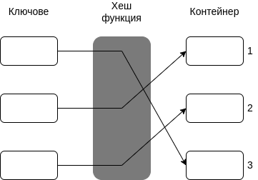
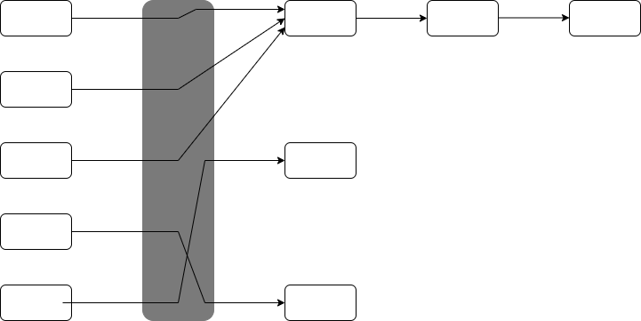

# Упраженение № 15
# Хеш таблици.

## STL complexity analysis

| Структура | Имплементация | Добавяне на елемент | Изтриване на елeмент | Намиране на елемент |
| --- | --- | --- |  --- |  --- |
| std::vector | динамичен масив | на произволно място - O(n) в края - O(1) амортизирано | O(n) | по индекс - O(1) |
| std::stack | std::deque (std::vector и std::list също са възможни) | O(1) | O(1) | O(1) |
| std::queue | std::deque, std::list | O(1) | O(1) | O(1) |
| std::forward_list | свързан списък с една връзка | на дадена позиция - O(1) | O(n) | O(n) |
| std::list | свързан списък с две връзки | на дадена позиция - O(1) | O(n) | O(n) |
| std::priority_queue | max heap | O(logn) | O(logn) | O(1) |
| std::set | двоично наредено дърво |  O(logn) | O(logn) | O(logn) |
| std::map | самобалансиращо се черно-червено дърво | O(logn) | O(logn) | O(logn) |
| std::unordered_set | хеш таблица | O(1) |  O(1) |  O(1) |
| std::unordered_map | хеш таблица | O(1) |  O(1) |  O(1) |
 

## Въведение в структура от данни - хеш таблица
Хеш таблица е структура от данни, която асоциира ключ с дадена стойност. Това се случва чрез така наречената хешираща функция (hash function).  

**Всяка имплементация на хеш таблица съдържа следните 3 компонента:**
- хешираща функция
- структура от данни, която поддържа основните операции: insert, search, delete
- структура от данни, която да се справя с колизии

### Хешираща функция
Функция, която по даден ключ генерира индекс - мястото за стойността, съответстваща на ключа.  

Проблем: Ако два различни ключа получат един и същи индекс, това се нарича колизия. Тогава трябва да бъде използвана допълнителна структура от данни за справянето с тези колизии.  

**Кога една хешираща функция е добра?**
- бърза
- предизвиква малко колизии 
- броят на колизиите на различните индекси е сравнително равен

**Добри хеш функции?**
k - ключ
m - размер на хеш таблицата

1. Division method

   h(k) = k mod n

2. Multiplication method

   h(k) = floor(m (kA mod 1))

3. Universal hashing
Хеширащата функция се избира независимо от ключа.

**Как се справяме с колизии?**
1. Chaining
При генреиране на един и същи индекс, стойностите се съхраняват в двойно-свързан списък на този индекс.

2. Linear probing
Проверява се дали следващия слот е свободен.

3. Quadratic probing
Като линейното пробване, но разстоянието между слотовете се увеличава с повече от 1.

4. Double hashing
При изникване на колизия се смята нова хеш функция за намиране на нов слот.

## Задачи

### Задача 1.
Да се напише функция, която намира левия изглед на дърво.

### Задача 2.
Да се открие дали вектор от цели числа съдържа подвектор, сумата на елементите, на който е 0.

<!-- 
Решение чрез Brute Force - припомняне:
Разглеждаме всички подмасиви от стартова позиция i до всяка позиция от i+1 до n. 
Сложност: O(n^2)
-->

Решение чрез unordered_set:  
Ако имаме добра хешираща функция с константна сложност, то:  
Създаваме множество от сумите, до индекс i. Ако:  

// 4 1 2 -3 6 5 
// 4 5 7 4 

- Дадена сума съществува, то сме намерили подвектор със сума 0.
- Ако намерим сума 0.

Сложност по време: O(n)  
Сложност по памет: O(n)  

### Задача 3.
Да се намерят всички двойки числа в масив, които имат абсолютна разлика k.  

Наивно решение: разглеждаме всяка двойка в масива и я връщаме, ако сме намерили желаната разлика.  
Сложност по време: O(n^2)

std::vector<int> v = {1, 5, 2, 4};
int k = 3;
(1 , 4)
(5 , 2)

### Задача 4.
Сортиране по честота и индекс  
Да се сортират елементите на масив спрямо тяхната честота и индекс.  
Ако два елемента имат различна честота, то този с по-голяма честота е първи.  
Ако два елемента имат еднаква честота, то този с по-малък индекс е първи.  

### Задача 5.
Даден е вектор от нули и единици. Да се намери най-големия подвектор, който има равен брой нули и единици.
